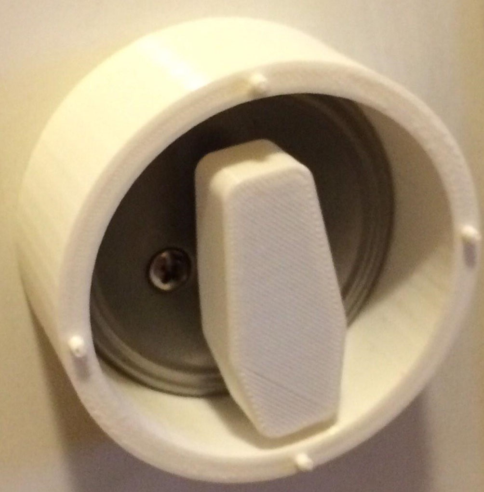

The Internet of Things. Colloquially known as the "IoT," the term refers to the collection of internet or network enable devices that is prevalent in the modern world. One might argue that every thing under the sun need not be connected to most other things, but I am loving the way companies such as GE and Belkin are creating basic home devices that can be controlled from anywhere. That being said, do we really need a dog feeder controlled by <a href="http://www.instructables.com/id/Twitter-Controlled-Pet-Feeder/">tweets?</a>
 
I recently became the proud owner of a MYO gesture control armband, available from <a href="https://www.thalmic.com/en/myo/">Thalmic Labs</a>. The arband can connect to PC's or Mac's through a proprietary Bluetooth dongle, or to mobile devices directly (Though the connection must be managed in individual mobile apps!). Being immensely interested in IoT projects, I set out to use the armband to interact with various devices in my home. Naturally, my first choice was something that was not already network (or anything) enabled: The front door. 
 
In order to connect the door lock to any sort of device, a physical interface was required. I mocked up a quick 3 section cylindrical housing for the lock mechanism, the servo to turn the lock, and an adapter to connect the servo to the lock. 
 
All of my code and 3D models are available <a href="https://github.com/KyleARector/MYO_Door_Jedi">here</a>.

